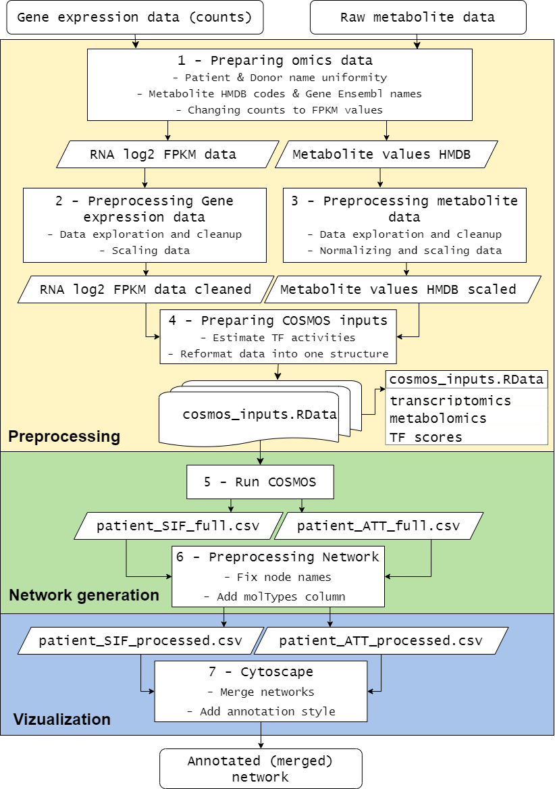

# COSMOS_EXIM

This repository is made as a back-up and version control for a research project at the Amsterdam UMC, location AMC Experimental Immunology-Hematology department. This project will utilize Saezlab's method COSMOS for regulatory network generation through the integration of multi-omic data. In this research, we applied the COSMOS method to gene expression and metabolomics datasets of CLL and healthy donor T cells.

## Pipeline explanation

We created the following 7-step pipeline, each step corresponding to a script, which can be found under [`scripts`](https://github.com/CatherM/COSMOS_EXIM/tree/main/scripts). This pipeline shows each step of the network generation workflow, from raw data to network visualization in Cytoscape.

The input is from unpublished sources, which can be requested via f.s.peters\@amsterdamumc.nl.

## Output

The networks can be found under `network_figures/individual` and `network_figures/merged`.

The thesis resulting from this research project can be found in this repository as `Thesis.pdf`.

## Requirements

IBM Cplex was used used as the ILP solver for COSMOS in this project. This was a requirement for this version of COSMOS. IBM provides CPLEX Optimization Studio freely under an academic license.

## Sources

Method sources:

-   COSMOS

Dugourd A, Kuppe C, Sciacovelli M, Gjerga E, Gabor A, Emdal KB, Vieira V, Bekker-Jensen DB, Kranz J, Bindels EMJ, Jesper V Olsen, Christian Frezza, Rafael Kramann, Julio Saez-Rodriguez et al (2021) Causal integration of multi-omics data with prior knowledge to generate mechanistic hypotheses. Mol Syst Biol 17: e9730

Dugourd A, Lafrenz P, Mañanes D, Fallegger R, Kroger AC, Turei D, Shtylla B, Saez-Rodriguez J; Modeling causal signal propagation in multi-omic factor space with COSMOS; BioRxiv. 2024 Jul 17 DOI: 10.1101/2024.07.15.603538

-   Cytoscape:

Shannon P., Markiel A., Ozier O., Baliga N.S., Wang J.T., Ramage D., Amin N., Schwikowski B., Ideker T. Cytoscape: a software environment for integrated models of biomolecular interaction networks. Genome Research 2003 Nov; 13(11):2498-504.

-   RCy3:

Otasek, et al., Cytoscape Automation: empowering workflow-based network analysis. Genome Biology, 20:185 (2019)
